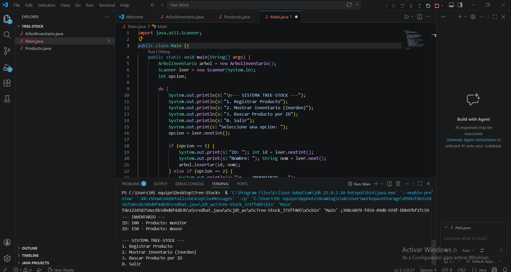
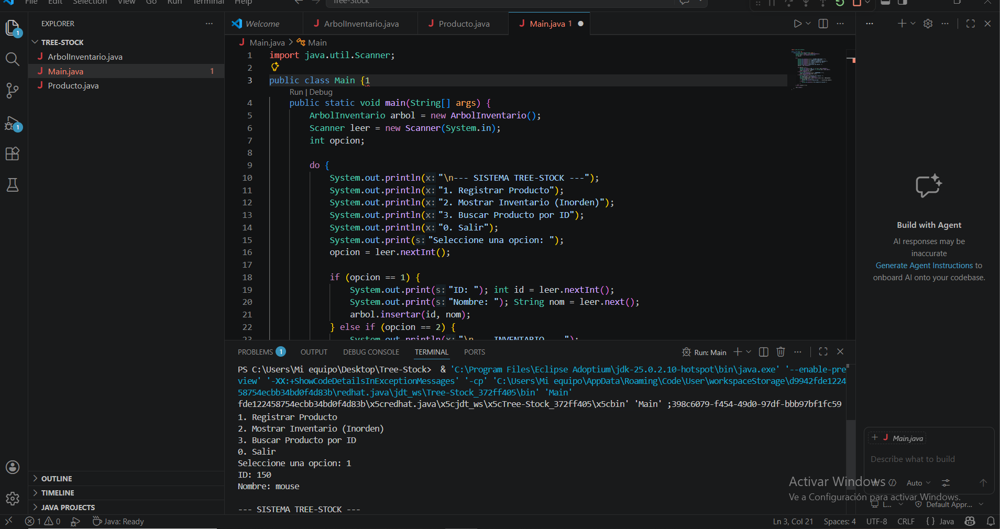
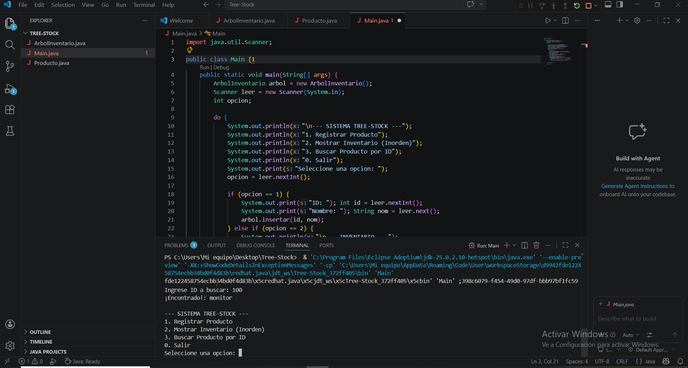

# Sistema de Inventario Tree-Stock 🌳

Este es un proyecto universitario desarrollado en **Java** que utiliza una estructura de datos de **Árbol Binario de Búsqueda (BST)** para gestionar un inventario de productos.

## Funcionalidades
* **Insertar Productos:** Agrega productos con un ID único.
* **Mostrar Inventario:** Lista los productos de forma ordenada (Inorden).
* **Buscar Producto:** Permite localizar un producto específico por su ID.

## Estructura del Código
* `Producto.java`: Define el modelo del nodo del árbol.
* `ArbolInventario.java`: Contiene la lógica de inserción, búsqueda y recorrido.
* `Main.java`: Interfaz de menú para el usuario.
## Evidencias de Ejecución

### Menú Principal e Inserción

### Inventario Ordenado (Inorden)

### Búsqueda de Producto

---
## 🎥 Video de Sustentación
Puedes ver la explicación detallada del código y el funcionamiento del sistema en el siguiente enlace:

👉 [**Ver Video de Sustentación (Google Drive)**](https://drive.google.com/file/d/1vP2fmt7mdZPqYYdtKvfQ6BNVkYBemuzU/view?usp=sharing)
---
